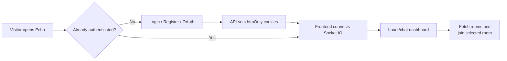
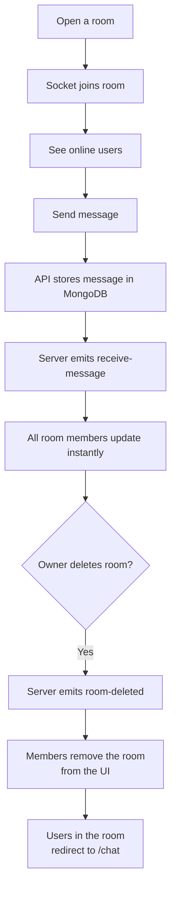

# Echo

Echo is a real-time team chat app built as a monorepo with a Next.js frontend and an Express + Socket.IO backend. It supports email/password auth, Google and GitHub OAuth, live channels, real-time messaging, online presence, and channel management with owner-only deletion.

## Features

- Real-time messaging with Socket.IO
- Channel creation and deletion
- Owner-only channel deletion controls
- Live online users list per room
- JWT-based authentication with httpOnly cookies
- Email/password sign up and login
- Google and GitHub OAuth login
- Searchable rooms dashboard
- Responsive dark UI built with Next.js App Router
- Docker Compose support for the API and MongoDB

## Tech Stack

- Frontend: Next.js 16, React 19, TypeScript, Zustand, Axios
- Backend: Express 5, TypeScript, Socket.IO, Passport, JWT, Zod
- Database: MongoDB with Mongoose
- OAuth: Google and GitHub
- Dev tooling: ESLint, ts-node-dev, Docker Compose

## Project Structure

```text
chat-api/       # Express API, auth, rooms, messages, sockets
chat-frontend/  # Next.js app, pages, chat UI, auth UI, client state
docker-compose.yml
```

## Architecture

- The frontend talks to the API through Axios using `NEXT_PUBLIC_API_URL`.
- Socket connections use `NEXT_PUBLIC_SOCKET_URL` and power message delivery, room join/leave events, and room create/delete broadcasts.
- Authentication uses httpOnly cookies set by the API.
- The backend stores users, rooms, and messages in MongoDB.





## Main User Flows

### Authentication

- Register with username, email, and password
- Login with email and password
- Sign in with Google or GitHub
- The landing page redirects authenticated users straight to `/chat`

### Chat

- View the rooms dashboard
- Search rooms by name or description
- Create a new room
- Open a room and send real-time messages
- See who is online in the current room
- Leave a room manually or get redirected when a room is removed

### Room Management

- Every room is owned by the user who created it
- Only the owner sees the Delete button
- Deleting a room removes it for all connected users in real time
- Connected users inside the removed room are redirected back to `/chat`

## API Overview

Base path: `/api`

### Auth

- `POST /auth/register`
- `POST /auth/login`
- `POST /auth/logout`
- `GET /auth/me`
- `GET /auth/google`
- `GET /auth/google/callback`
- `GET /auth/github`
- `GET /auth/github/callback`

### Rooms

- `GET /room`
- `POST /room`
- `GET /room/:id`
- `DELETE /room/:id`

### Messages

- `GET /message/:roomId`

### Health Check

- `GET /api/healthcheck`

## Socket Events

### Client to Server

- `join-room`
- `leave-room`
- `send-message`

### Server to Client

- `receive-message`
- `user-joined`
- `user-left`
- `room-created`
- `room-deleted`
- `online-users`

## Environment Variables

### `chat-api/.env`

```env
PORT=8000
CLIENT_URL=http://localhost:3000
MONGO_URL=mongodb://localhost:27017/chat-app
JWT_SECRET_KEY=your_access_token_secret
JWT_REFRESH_SECRET_KEY=your_refresh_token_secret
GOOGLE_CLIENT_ID=your_google_client_id
GOOGLE_CLIENT_SECRET=your_google_client_secret
GOOGLE_CALLBACK_URL=http://localhost:8000/api/auth/google/callback
GITHUB_CLIENT_ID=your_github_client_id
GITHUB_CLIENT_SECRET=your_github_client_secret
GITHUB_CALLBACK_URL=http://localhost:8000/api/auth/github/callback
NODE_ENV=development
```

### `chat-frontend/.env.local`

```env
NEXT_PUBLIC_API_URL=http://localhost:8000/api
NEXT_PUBLIC_SOCKET_URL=http://localhost:8000
```

## Getting Started

### Prerequisites

- Node.js 18+ recommended
- MongoDB running locally, or Docker

### 1. Clone and install

```bash
cd chat-api
npm install

cd ../chat-frontend
npm install
```

### 2. Start MongoDB and the API

You can use Docker Compose for MongoDB and the API service:

```bash
docker compose up --build
```

Or run the API directly in development mode after setting up `chat-api/.env`:

```bash
cd chat-api
npm run dev
```

### 3. Start the frontend

```bash
cd chat-frontend
npm run dev
```

The app will be available at `http://localhost:3000`.

## Build Commands

### Backend

```bash
cd chat-api
npm run build
npm start
```

### Frontend

```bash
cd chat-frontend
npm run build
npm start
```

## Notes

- The API uses JWT cookies, so `withCredentials` must remain enabled in the frontend Axios client.
- OAuth callbacks must match the provider redirect URLs exactly.
- The Docker Compose file currently provisions the API and MongoDB, not the frontend.

## License

No license has been specified yet.
